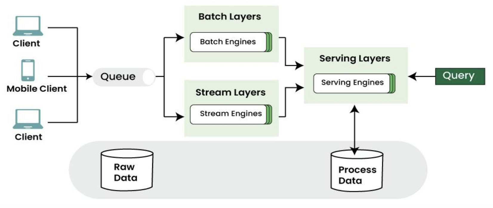
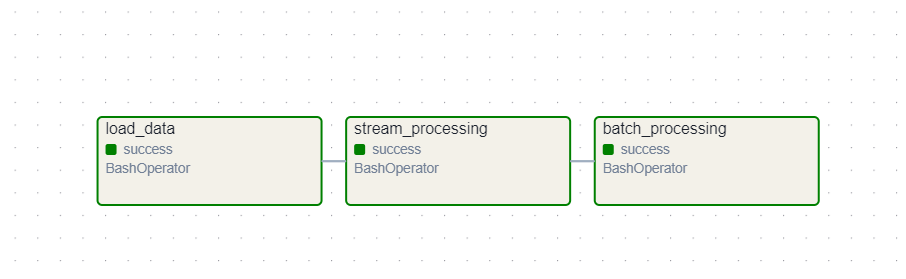

# Credit Card Transaction Processing - Lambda Architecture

This project demonstrates a **Lambda Architecture** approach to processing credit card transactions using **PySpark**, **Kafka**, and **MySQL**. It includes real-time and batch data processing to validate transactions, update balances, and calculate credit scores.

---

## 🚀 Overview

- **Real-time (Stream Layer)**: Consumes transactions in real-time from Kafka, validates them, and updates pending balances.
- **Batch Processing (Batch Layer)**: Periodically processes accumulated data to update master records, reflecting approved transactions and adjusted credit limits.
- **Serving Layer**: Makes processed data accessible via MySQL.

The project highlights how to integrate distributed data processing with real-world use cases like transaction validation, credit score calculation, and fraud prevention.



- **Airflow** : Implemented process scheduling with the help for Apache Airflow to automate the task



---

## 📁 Project Structure

```
.
├── src/
    ├── main.py                # Load initial data from CSV into MySQL and from MySQL into Spark
    ├── producer.py            # Sends transactions to Kafka from MySQL
    ├── consumer.py            # Consumes transactions, validates and updates them
    ├── batch_processor.py     # Approves pending transactions, updates balances and credit scores
    ├── data_processor.py      # Core data loading, transformation, batch logic
    ├── helper.py              # Contains helper functions for credit logic and location proximity
├── data/                  # CSV data files and output results
├── dags/                  # Contains the airflow dag file
└── .env                   # Environment variables (MySQL config, table names, etc.)
```

## :gear: Packages Used

- `pyspark`
- `kafka-python`
- `python-dotenv`
- `mysql-connector-python`
- `os`, `json`, `csv`, `datetime`, `glob`, `shutil`

---

## 🔍 Key Components & Functions

### 1️⃣ Data Loading & Setup (`data_processor.py` and `main.py`)

- `load_config()`, `setup_configuration()`: Load environment settings.
- `load_into_mysql()`: Truncate tables and load fresh data from CSV.
- `load_from_mysql()`: Read MySQL tables into PySpark DataFrames.
- `save_to_csv()`: Save Spark DataFrames as CSV.

### 2️⃣ Real-time Stream Processing (`producer.py`, `consumer.py`)

- `create_producer()`, `create_consumer()`: Set up Kafka producer/consumer.
- `build_lookup_dicts()`, `test_all_checks()`: Create lookup data and validate transactions (balance limits, location checks, etc.).
- `process_transaction()`, `finalize_output()`: Process and finalize transactions.

### 3️⃣ Batch Processing (`batch_processor.py`)

- `batch_processing()`: Orchestrates batch updates:
  - Marks pending transactions as approved.
  - Updates balances (`generate_cards_updated()`).
  - Recalculates credit scores (`update_credit_score()`).
  - Adjusts credit limits (`update_credit_limit()`).
  - Saves updated data to CSV.

### 4️⃣ Helper Functions (`helper.py`)

- `is_location_close_enough()`: Validates merchant proximity to customer.
- `calculate_credit_score_adjustment()`, `calculate_new_credit_limit()`: Credit logic based on usage and scores.

---

## Setting up the project

### 1. Download and Setup Kafka

```bash
# Create a directory for Kafka
mkdir -p ~/kafka
cd ~/kafka

# Download Kafka 3.8.1
wget https://downloads.apache.org/kafka/3.8.1/kafka_2.13-3.8.1.tgz

# Extract the archive
tar -xzf kafka_2.13-3.8.1.tgz
```

### 2. Start Kafka Server

```bash
# Start Zookeeper (in a separate terminal)
cd ~/kafka/kafka_2.13-3.8.1
bin/zookeeper-server-start.sh config/zookeeper.properties

# Start Kafka server (in another terminal)
cd ~/kafka/kafka_2.13-3.8.1
bin/kafka-server-start.sh config/server.properties
```
### 3. Create Kafka Topic

```bash
# Create the 'project4' topic
cd ~/kafka/kafka_2.13-3.8.1
bin/kafka-topics.sh --create --topic project4 --bootstrap-server localhost:9092 --partitions 1 --replication-factor 1
```

## Running the project

Terminal 1 (Data Loading):
```bash
python src/main.py
```

Terminal 2 (Consumer):
```bash
python src/consumer.py
```

Terminal 3 (Producer):
```bash
python src/producer.py
```

Terminal 4 (Batch Processing):
```bash
python src/batch_processor.py
```


## License and Usage Restrictions

Copyright © 2025 Zimeng Lyu. All rights reserved.
This project was developed by Zimeng Lyu for the RIT DSCI-644 course, originally designed for GitLab CI/CD integration. It is shared publicly for portfolio and learning purposes.

🚫 Usage Restriction:

This project may not be used as teaching material in any form (including lectures, assignments, or coursework) without explicit written permission from the author.

📩 For inquiries regarding usage permissions, please contact Zimeng Lyu at zimenglyu@mail.rit.edu.